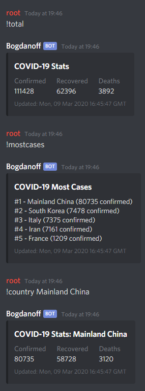

# discord-covid-19

A small Discord bot for displaying stats about [2019-20 coronavirus outbreak](https://en.wikipedia.org/wiki/2019%E2%80%9320_coronavirus_outbreak).

### Notes

* Don't forget to set the bot token inside config.json! You can get a bot token by following [this guide](https://discordjs.guide/preparations/setting-up-a-bot-application.html#creating-your-bot).

* You can mention the bot as an alternative to using the prefix.